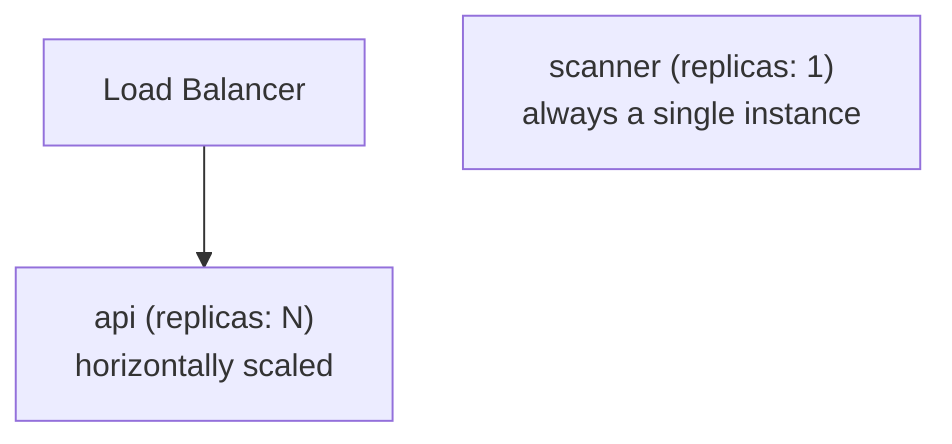
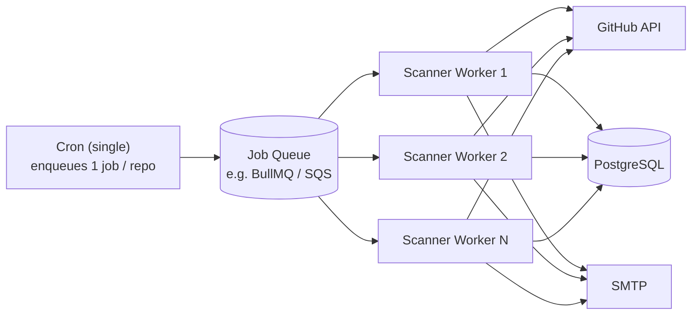

# ADR-002: Scanner Deduplication Under Horizontal Scaling

**Status:** Proposed

**Date:** 2026-05-13

**Author:** [Stanislav Hohulia](https://github.com/Hradivnyk)

## Context

The current design runs `node-cron` inside the main application process. When multiple instances are deployed, each independently executes a full scan cycle, causing every subscriber to receive duplicate notifications per tick.

## Considered Options

### Option 1 — PostgreSQL Advisory Lock (minimal changes)

Before starting the scan cycle, an instance attempts to acquire a session-level advisory lock via `pg_try_advisory_lock(bigint)`. If the lock is already held by another instance, the current one skips the tick.

```sql
-- scanner executes before starting work
SELECT pg_try_advisory_lock(12345);
-- returns true  → this instance runs the scan
-- returns false → another instance is already running, skip tick
```

**Pros:** requires no new infrastructure; implemented in a few lines of code.  
**Cons:** the lock is tied to the session — a crashed process automatically releases the lock, but there may be a window with no scanning between process death and the next tick.

---

### Option 2 — Leader Election with Heartbeat

Extension of Option 1: a background interval (e.g. every 30 s) holds the lock and updates `last_heartbeat` in a dedicated `scanner_leader` table. Other instances check heartbeat freshness and take over the leader role if the current leader has been silent for longer than N seconds.

```sql
CREATE TABLE scanner_leader (
  id             INT PRIMARY KEY DEFAULT 1,  -- always a single row
  instance_id    TEXT NOT NULL,
  last_heartbeat TIMESTAMPTZ NOT NULL
);
```

**Pros:** automatic failover when the leader crashes; transparent logic.  
**Cons:** additional table + heartbeat logic; slight extra DB load.

---

### Option 3 — Extract the Scanner into a Dedicated Worker

Move the scan cycle into a standalone service/container (`scanner-worker`) that is always deployed as a single instance (`replicas: 1` in Docker Compose / Kubernetes Deployment). The HTTP server scales horizontally and independently.



**Pros:** architecturally clean separation of concerns; eliminates the duplication problem without any lock mechanisms.  
**Cons:** requires refactoring the deployment and a separate Docker image or entrypoint. Still a single-threaded bottleneck — does not protect against job overlap when a slow scan cycle is overtaken by the next cron tick.

---

### Option 4 — Distributed Work Queue

Addresses two problems that Options 1–3 do not solve simultaneously: **safe parallel execution** across multiple workers and **job overlap prevention** when a scan cycle exceeds the cron interval.

**How it works:**

1. A lightweight cron process runs on a single instance and only **enqueues one job per repository** per tick — it performs no GitHub API calls itself.
2. A pool of **N stateless scanner workers** dequeue and process jobs independently, each making exactly one GitHub API request per job.
3. Jobs have a **visibility timeout**: if a worker crashes mid-job, the job becomes visible again after the timeout and is retried by another worker.
4. The cron process can fire even if the previous wave of jobs is still being processed — workers drain the queue at their own pace without overlap.



**Queue options:**

| Option                 | Infrastructure | Notes                                                                |
| ---------------------- | -------------- | -------------------------------------------------------------------- |
| BullMQ + Redis         | Redis instance | Good fit for Node.js; supports retries, delays, concurrency limits   |
| PostgreSQL SKIP LOCKED | No new infra   | Uses `SELECT … FOR UPDATE SKIP LOCKED`; works well at moderate scale |
| AWS SQS                | Managed AWS    | Natural fit if already on AWS; visibility timeout built-in           |

**Pros:** true horizontal scalability; overlap-safe by design; built-in retries on worker crash.  
**Cons:** introduces a new infrastructure component (queue broker); significantly more complex than Options 1–3.

## Decision

Deferred — not required for the current single-instance deployment.

## Consequences

For the current constraints (single EC2), **Option 1** is sufficient — it eliminates the risk of duplicate notifications if two instances are accidentally started, with zero infrastructure changes. When moving to production-scale with a high number of repositories or strict latency requirements, **Option 4** is the correct long-term solution; **Option 3** is a reasonable intermediate step.
