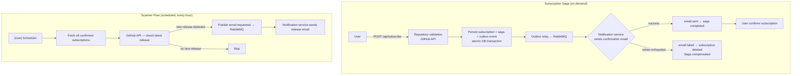
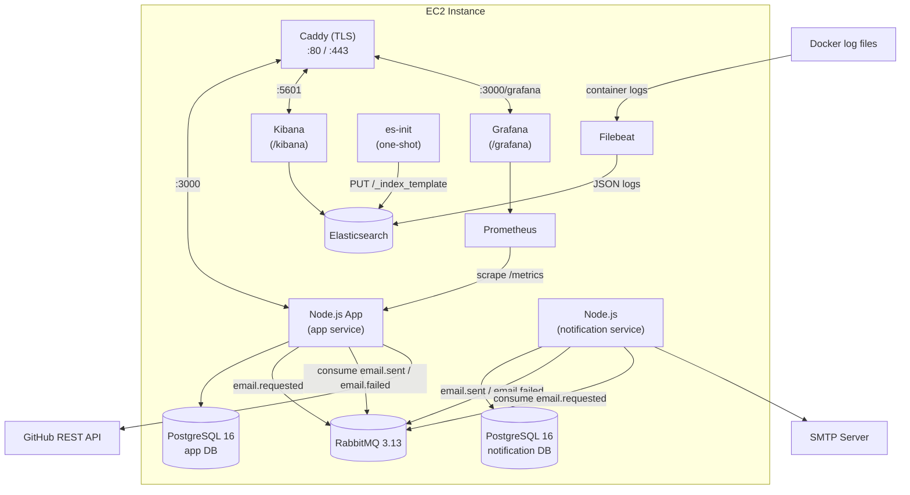
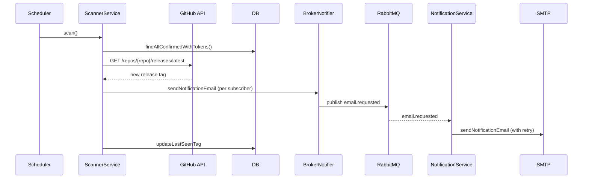
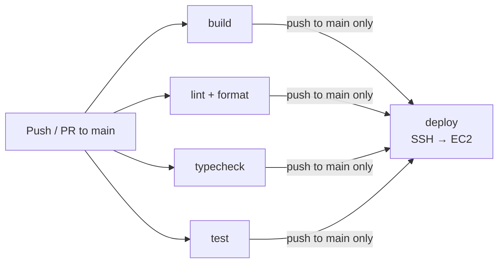

# System Design: Release Owl

## Table of Contents

1. [System Overview](#1-system-overview)
2. [System Requirements](#2-system-requirements)
3. [Constraints](#3-constraints)
4. [High-Level Architecture](#4-high-level-architecture)
5. [Component Design](#5-component-design)
6. [RabbitMQ Event Contracts](#6-rabbitmq-event-contracts)
7. [Testing and CI](#7-testing-and-ci)
8. [Future Work](#8-future-work)

**Detailed docs:**
- [Orchestrated Saga](saga.md) — sequence diagrams, compensation, idempotency
- [Data Model](data-model.md) — schemas, ER diagram, migrations
- [Observability](observability.md) — logging, metrics, alerting
- [REST API](../swagger.yaml) — OpenAPI / Swagger spec

---

## 1. System Overview

**Release Owl** is an HTTP service that allows users to subscribe to email notifications about new releases of GitHub repositories. The service periodically polls the GitHub API and sends emails to subscribers when a new release tag is detected.

Two runtime services communicate via RabbitMQ:

- **`app`** — API server, release scanner, and **Saga orchestrator**. Handles subscriptions, validates repos via GitHub API, detects new releases, drives the subscribe→email-delivered distributed transaction.
- **`notification`** — standalone microservice with its **own PostgreSQL database**. Consumes `email.requested` commands, delivers emails via SMTP, publishes `email.sent` / `email.failed` saga reply events.



---

## 2. System Requirements

### Functional

| # | Requirement |
| - | ----------- |
| F-01 | Subscribe by email + `owner/repo` |
| F-02 | Validate repository via GitHub REST API before persisting |
| F-03 | Double opt-in: subscription active only after email confirmation |
| F-04 | Confirmation email sent after subscribe (via Saga) |
| F-05 | Email notifications to all confirmed subscribers on new release |
| F-06 | Each notification email contains an unsubscribe link |
| F-07 | Unsubscribe at any time via token link |
| F-08 | API to list subscriptions for an email |
| F-09 | `(email, repo)` unique — duplicate returns 409 |
| F-10 | Static landing page for subscribe without API |
| F-11 | Swagger UI at `/api/docs` |

### Non-Functional

| Category | Requirement | Target |
| -------- | ----------- | ------ |
| **Availability** | Uptime | ≥ 99% (single EC2) |
| **Reliability** | Confirmation email delivery | Transactional outbox → at-least-once |
| **Reliability** | Consistency (pending subscription) | Orchestrated Saga: compensates on permanent email failure |
| **Reliability** | SMTP transient failures | Retry with exponential backoff (3 attempts) |
| **Reliability** | Broker connection loss | Auto-reconnect (up to 10 retries) |
| **Security** | Brute-force | Rate limit: 100 req / 15 min / IP |
| **Security** | API auth | `X-API-Key` (timing-safe comparison) |
| **Security** | Transport | TLS via Caddy in production |

---

## 3. Constraints

- **GitHub API rate limit:** 60 req/hour without token, 5 000 req/hour with `GITHUB_TOKEN`.
- **In-process scheduler:** `node-cron` shares the Event Loop with the HTTP server — long scans can delay requests.
- **At-least-once delivery:** the outbox relay may re-publish an event after a crash. The notification service handles duplicates via inbox deduplication (`saga_id` PK).
- **No horizontal scaling:** multiple instances would produce duplicate release notifications (see [Future Work](#8-future-work)).
- **Single-node PostgreSQL and RabbitMQ** — no replicas, no DLQ configured.

---

## 4. High-Level Architecture



> Sequence diagrams for the Saga flows: → [saga.md](saga.md)

### Scanner Flow



---

## 5. Component Design

### 5.1 HTTP Server (Express 5)

Middleware pipeline (in order):
```
express.static(public/)   → landing page
helmet()                  → security headers
cors()                    → CORS allowlist
rateLimit(100/15min/IP)   → brute-force protection
pinoHttp()                → structured request logging
express.json/urlencoded() → body parsing
swagger-ui (/api/docs)    → OpenAPI docs
subscriptionRoutes (/api) → business endpoints
errorHandler()            → centralized error mapping
```

Errors: `ZodError` → 400; custom `AppError` subclasses → their HTTP codes; unexpected → 500.

### 5.2 Subscription Service

| Method | Action |
| ------ | ------ |
| `subscribe(email, repo)` | Validate repo → check duplicate → atomically INSERT subscription + saga row + outbox event |
| `confirm(token)` | Validate format → UPDATE status=confirmed |
| `unsubscribe(token)` | Validate format → DELETE subscription |
| `getSubscriptions(email)` | Return all confirmed subscriptions |

The three writes in `subscribe` share one transaction — subscription, saga state, and the email command commit or roll back together.

### 5.3 Saga Orchestrator

See [saga.md](saga.md) for full detail and sequence diagrams.

| Component | Role |
| --------- | ---- |
| `SagaReplyConsumer` | Subscribes to `email.sent` / `email.failed` reply queues |
| `SubscriptionSagaOrchestrator` | `email.sent` → mark completed; `email.failed` → delete subscription + mark compensated |
| `SubscriptionSagaModel` | CRUD on `subscription_sagas` |

### 5.4 Notification Service

See [saga.md](saga.md) for the participant flow.

| Component | Role |
| --------- | ---- |
| `EmailRequestedConsumer` | Consumes `email.requested`; saga participant for `confirmation` type |
| `InboxModel` | Deduplicates by `saga_id` — exactly-once send per command |
| `OutboxModel` / `OutboxRelay` | Reliably publishes `email.sent` / `email.failed` replies |
| `RetryingEmailSender` | Exponential backoff (default 3 attempts, 500 ms initial) |
| `EmailTemplateBuilder` | Renders confirmation and notification email text |

Release notification emails (`type: 'notification'`) remain fire-and-forget — no saga, no reply.

### 5.5 Outbox Relay (both services)

Polls every `OUTBOX_POLL_INTERVAL_MS` (default 1 000 ms). Claims rows with `SELECT … FOR UPDATE SKIP LOCKED` in batches of `OUTBOX_BATCH_SIZE` (default 50). Claim + publish + mark-published run in one transaction → at-least-once delivery. Skips a cycle if the previous drain is still running.

### 5.6 Scanner Service

Cron job (`SCANNER_CRON_SCHEDULE`, default `0 * * * *`):
1. Load all confirmed subscriptions with `last_seen_tag`.
2. Group by `repo` → 1 GitHub API call per repo.
3. Compare `release.tag_name` vs `last_seen_tag`.
4. On new release: publish `email.requested` per subscriber via `BrokerNotifier` (`Promise.allSettled` — one failure doesn't stop the rest).
5. Update `last_seen_tag`.

### 5.7 GitHub Service

| Method | Endpoint | Behavior |
| ------ | -------- | -------- |
| `repositoryExists(repo)` | `GET /repos/{owner}/{repo}` | 200 → true, 404 → false, 429/403 → throw `GitHubRateLimitError` |
| `getLatestRelease(repo)` | `GET /repos/{owner}/{repo}/releases/latest` | 200 → `{tag_name}`, 404 → null, 429/403 → throw |

`Retry-After` header takes priority over `X-RateLimit-Reset` for rate-limit reset time.

### 5.8 Config

**`app` service:**
```
DATABASE_URL            required
API_KEY                 required
RABBITMQ_URL            optional  (default: amqp://localhost:5672)
GITHUB_TOKEN            optional  (increases rate limit to 5 000/hour)
BASE_URL                optional  (default: http://localhost:3000)
PORT                    optional  (default: 3000)
SCANNER_CRON_SCHEDULE   optional  (default: '0 * * * *')
OUTBOX_POLL_INTERVAL_MS optional  (default: 1000)
OUTBOX_BATCH_SIZE       optional  (default: 50)
```

**`notification` service:**
```
DATABASE_URL            required  (own PostgreSQL)
SMTP_HOST               required
SMTP_USER               required
SMTP_PASS               required
SMTP_FROM               required
RABBITMQ_URL            optional  (default: amqp://localhost:5672)
SMTP_PORT               optional  (default: 587)
BASE_URL                optional  (default: http://localhost:3000)
EMAIL_RETRY_ATTEMPTS    optional  (default: 3)
EMAIL_RETRY_BACKOFF_MS  optional  (default: 500)
HEALTH_PORT             optional  (default: 3002)
OUTBOX_POLL_INTERVAL_MS optional  (default: 1000)
OUTBOX_BATCH_SIZE       optional  (default: 50)
```

---

## 6. RabbitMQ Event Contracts

Exchange: `release-owl.events` (topic, durable). All messages persistent.

| Routing key | Producer | Consumer | Queue |
| ----------- | -------- | -------- | ----- |
| `email.requested` | `app` outbox relay / scanner | `notification` | `notification.email-requested` |
| `email.sent` | `notification` outbox relay | `app` orchestrator | `app.email-sent` |
| `email.failed` | `notification` outbox relay | `app` orchestrator | `app.email-failed` |

Schemas are defined in `@release-owl/contracts` (`packages/contracts/src/events/`):

```typescript
// email.requested — confirmation (carries saga_id)
{ type: "confirmation", email, repo, confirm_token, saga_id: string }

// email.requested — release notification (fire-and-forget)
{ type: "notification", email, repo, tag_name, unsubscribe_token }

// email.sent / email.failed
{ saga_id: string, repo: string }
{ saga_id: string, repo: string, reason: string }
```

---

## 7. Testing and CI

### Test Layers

| Layer | Tool | Scope |
| ----- | ---- | ----- |
| Unit | Jest | Business logic in isolation (mocked DB, broker, SMTP) |
| Integration | Jest + Supertest | Full HTTP cycle against real test DB |
| E2E | Playwright + Mailhog | Browser → subscribe → confirm email in MailHog |

### Unit Test Files

| File | What is tested |
| ---- | -------------- |
| `src/modules/subscriptions/__tests__/subscription.service.test.ts` | subscribe (with saga), confirm, unsubscribe, duplicate detection |
| `src/modules/sagas/__tests__/subscription-saga.orchestrator.test.ts` | `onEmailSent` → completed; `onEmailFailed` → delete + compensated; idempotency |
| `src/modules/sagas/__tests__/saga-reply.consumer.test.ts` | Routes `email.sent` / `email.failed` to orchestrator |
| `src/modules/releases/__tests__/scanner.service.test.ts` | Scan cycle, release detection, notification dispatch |
| `src/modules/releases/__tests__/release.handler.test.ts` | `Promise.allSettled` failure isolation, tag update |
| `src/modules/github/__tests__/github.service.test.ts` | Repo check, release fetch, rate-limit handling |
| `src/modules/outbox/__tests__/outbox.relay.test.ts` | Drain batching, at-least-once publish |
| `packages/platform/src/broker/__tests__/rabbitmq.broker.test.ts` | Publish, subscribe, reconnect, dead-letter on failure |
| `services/notification/src/__tests__/email-requested.consumer.test.ts` | Saga path: email.sent on success; email.failed on exhaustion; inbox idempotency |
| `services/notification/src/__tests__/retrying-email.sender.test.ts` | Retry backoff, exhaustion |

### CI Pipeline



All four jobs run in parallel. `deploy` triggers only on push to `main` after all checks pass.

---

## 8. Future Work

- [ADR-002: Scanner Deduplication Under Horizontal Scaling](adr/ADR-002-scanner-horizontal-scaling.md)
- [ADR-003: ELK Stack for Log Aggregation](adr/ADR-003-elk-stack-logging.md)
